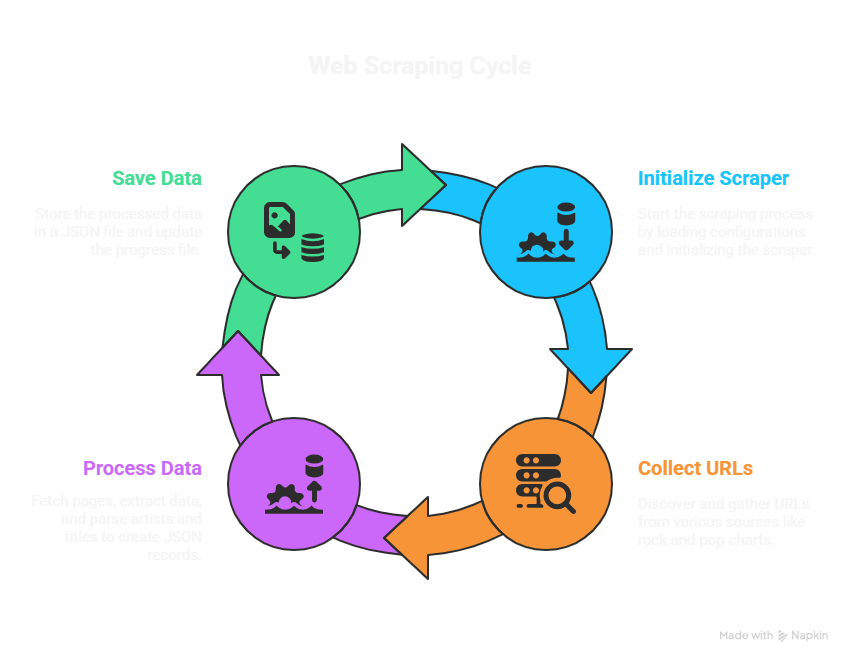

# Tunecaster Charts Collector

This is a web scraping project that collects music chart data from tunecaster.com. It scrapes both Pop and Rock music charts and saves them in JSON format.

## Project Workflow



The above diagram shows the main components of the scraping process:
- **URL Collection**: Discovers and collects all chart URLs for both Rock and Pop charts
- **Data Processing**: Processes each page to extract song information
- **Data Storage**: Saves the collected data and maintains progress
- **Initialization**: Handles setup and resuming of the scraping process

## What This Project Does

- Scrapes music charts from tunecaster.com
- Collects both Pop charts (from 1960s-2000s) and Rock charts (from 1980s-2000s)
- For each song in the charts, it collects:
  - Chart Rank
  - Song title
  - Artist name(s)
  - Chart date
- Saves all data in JSON format
- Can resume scraping if interrupted

## Requirements

Before running this project, you need to install the required Python packages. Create a virtual environment and install the dependencies:

```bash
# Create virtual environment
python -m venv venv

# Activate virtual environment
# On Windows:
venv\Scripts\activate
# On Linux/Mac:
source venv/bin/activate

# Install required packages
pip install -r requirements.txt
```

## How to Run

1. Make sure you have activated the virtual environment
2. Run the scraper:
   ```bash
   python tunecaster_charts_scraper.py
   ```
3. The script will:
   - First discover all chart URLs
   - Start scraping rock charts first, then pop charts
   - Save progress continuously
   - Create two files in the `data` folder:
     - `charts_data.json`: Contains all the scraped chart data
     - `scraper_progress.json`: Keeps track of which URLs have been processed

## Output Files

- `data/charts_data.json`: Contains all the chart data in JSON format. Example of a record:
  ```json
  {
    "id": "rock_0053_001",
    "chart_date": "2000-12-30",
    "rank": 1,
    "title": "Warning",
    "artist": [
      "Green Day"
    ],
    "url": "https://tunecaster.com/charts/00/rock0053.html"
  }
  ```
- `data/scraper_progress.json`: Contains progress information to resume scraping if interrupted

## Features

- Automatically handles both rock and pop charts
- Saves progress so you can resume if the script stops
- Shows real-time progress while scraping
- Handles different artist formats (featuring, with, etc.)
- Includes error handling and retry mechanisms
- Shows summary of collected data at the end

## Note

- The script includes delays between requests to be respectful to the website
- If the script is interrupted, you can run it again and it will continue from where it left off
- The script uses Playwright for web scraping, which handles JavaScript-rendered content
